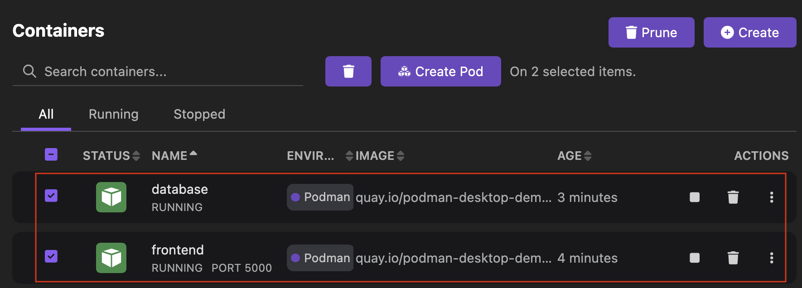
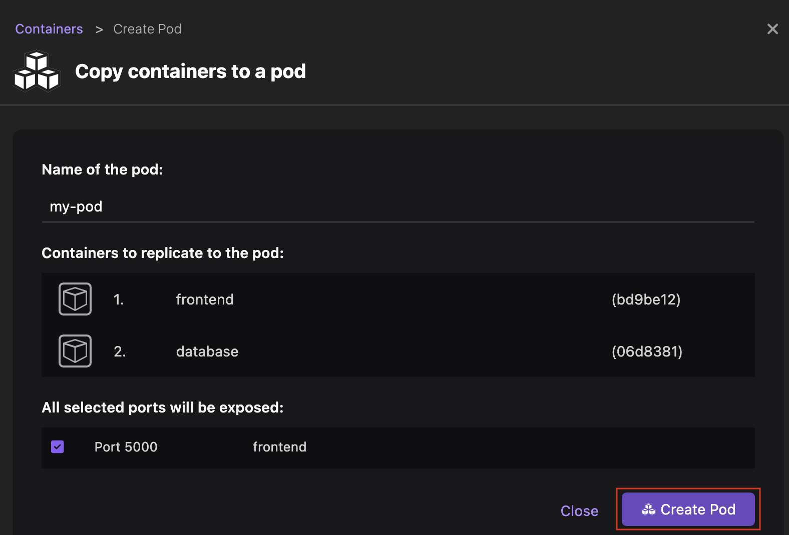
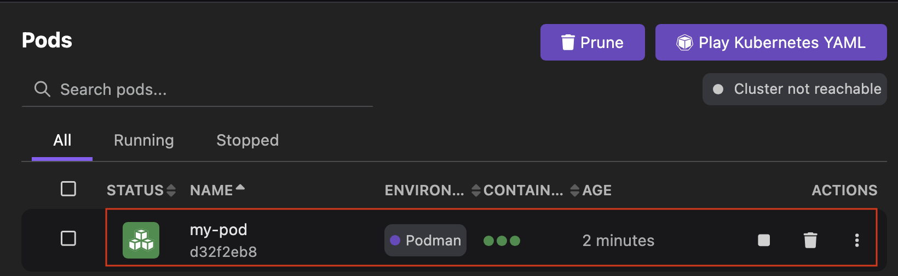
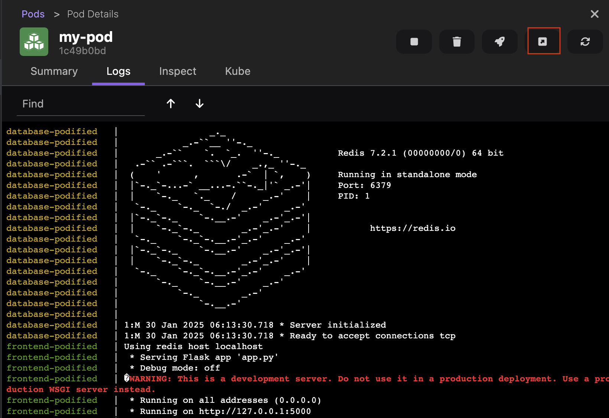

# Creating a pod from selected containers

With Podman Desktop, you can create a pod from your selected containers and run it on the Podman container engine.

Consider running containers in a pod to:

1. Expose your `frontend` application to the public network.
2. Protect your `database` container in a private network.

#### Prerequisites

- You are using the Podman container engine.
- Your containers, such as `database` and `frontend`, running or stopped, are available on the Containers page.
- The `frontend` container is configured to access the service exposed by the `database` container on localhost, such as `localhost:5000`.

#### Procedure

1. Go to **Containers** from the left navigation pane.
1. Select the containers, such as `database` and `frontend`.
   
1. Click **Create Pod**.
1. Optional: Edit the name of the pod. The default name is `my-pod`.
1. Check that the correct ports are exposed.
1. Click **Create Pod**.
   

#### Verification

1. View the newly created pod on the **Pods** component page.
   
1. Click the name of the pod to view its logs.
1. Click the **Open Browser** icon. Your browser opens the service exposed by your `frontend-podified` container.
   

#### Additional resources

- [Blog- Creating a pod](https://podman-desktop.io/blog/2024/10/05/kubernetes-blog#creating-a-pod)
- [Managing containers and pods](https://podman-desktop.io/tutorial/managing-your-application-resources#managing-containers-and-pods)
