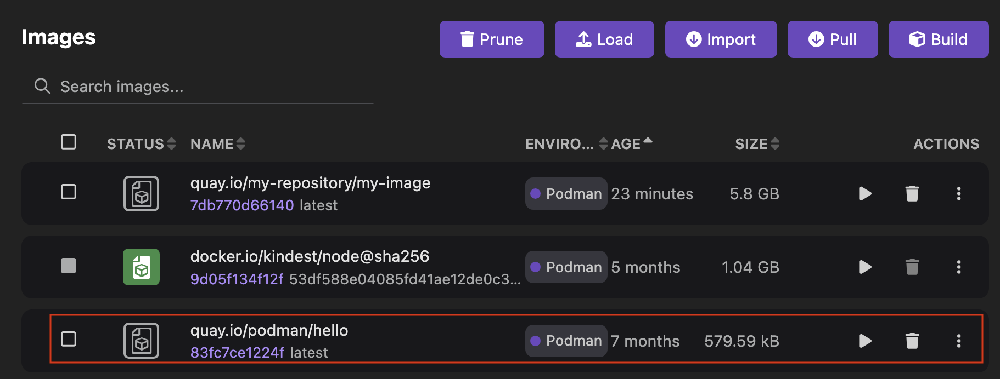

# Pulling an image to your container engine

With Podman Desktop, you can pull an image from a registry to your container engine.

#### Prerequisites

- The image is available in a registry.
- If the registry or the image is not publicly available, you configured access to the registry on Podman Desktop in **<Icon icon="fa-solid fa-cog" size="lg" /> Settings > Registries**.

#### Procedure

1. Go to **Images** from the left navigation pane.
1. Click **Pull**.
   
1. Enter the image name, such as `quay.io/podman/hello`.

   :::note

   Prefer the fully qualified image name that specifies the registry over the short name, which might lead to registry resolution errors.

   :::

1. Click **Pull image**.
   
1. Click **Done**.

#### Verification

1. View the pulled image on the same page.
   
1. Click the name of the image to view its summary.
1. Optional: View the history of the image or inspect the image.
