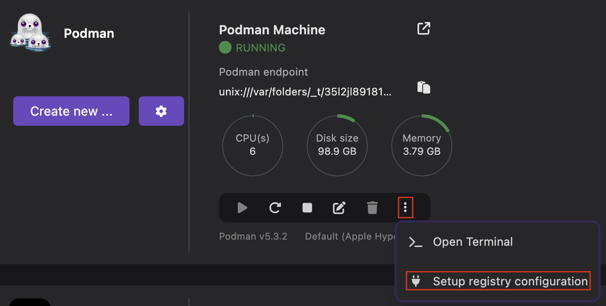
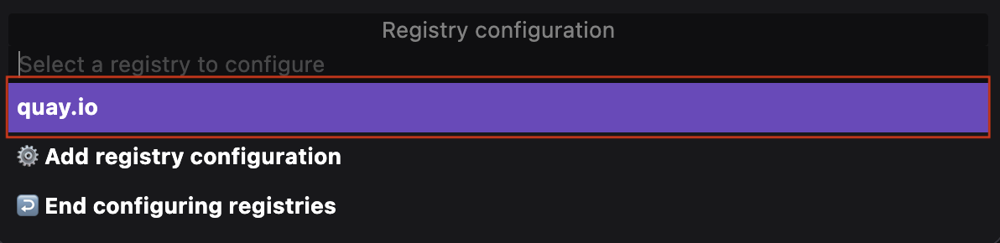
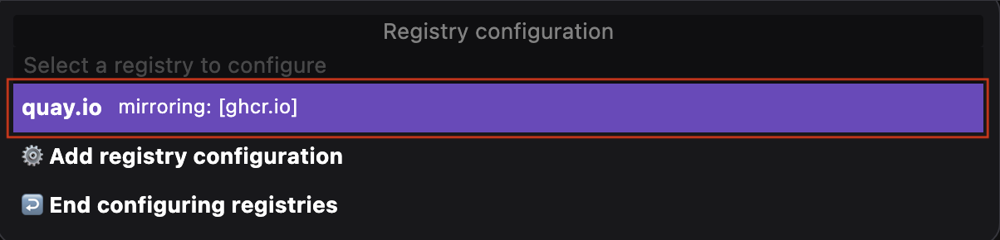
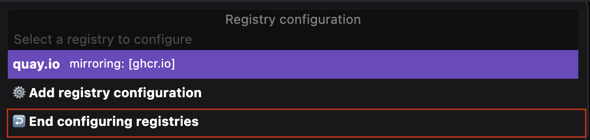

# Configuring a mirror registry

You can add registry locations and configure their mirrors by using the Podman Desktop UI. By configuring a mirror, you can redirect a registry to another location and use its content, such as images, files, and other resources during development.

#### Prerequisites

- [Recreate your Podman machine](/docs/podman/creating-a-podman-machine) to mount the registry configuration file.
- Upgrade to the latest version of Podman.

#### Procedure

1. Go to the **Settings > Resources** page.
1. Select **More Options > Setup registry configuration** in the Podman tile. A command palette opens.
   
1. Set up your registry configuration:
   1. Select the **Add registry configuration** option from the command palette.
      
   1. Type the location of the registry, such as `quay.io`, and press the `Enter` key. The `quay.io` registry is added to the palette.
      
   1. Select `quay.io` from the command palette.
   1. Type the location where you want to mirror the registry, such as `ghcr.io`, and press the `Enter` key. The entry for the `quay.io` registry shows the location where it is mirrored.
      
   1. Select the `End configuring registries` option to end registry configuration.
      
