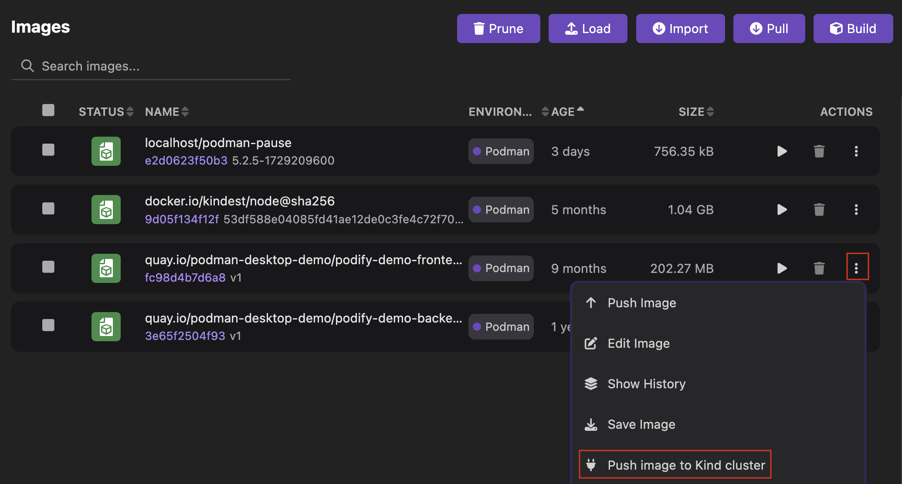
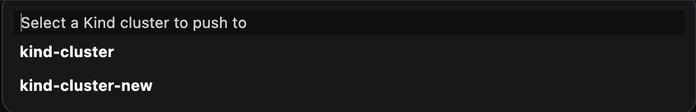
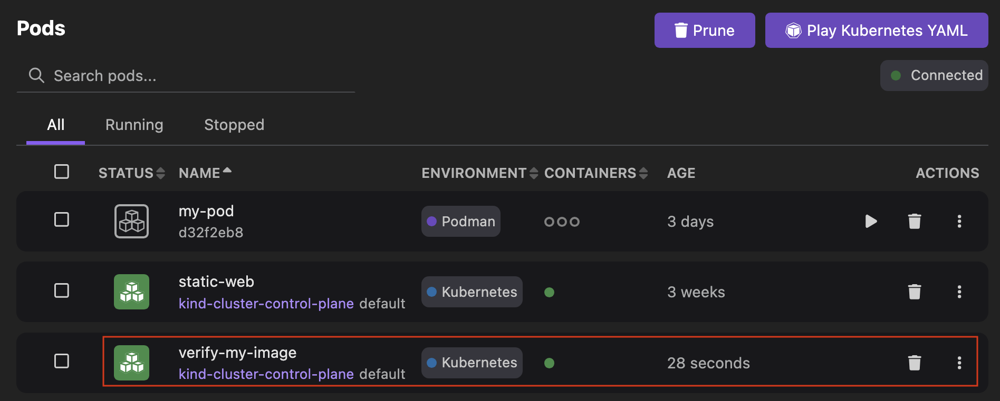

# Pushing an image to your local Kind-powered Kubernetes cluster

With Podman Desktop, you can push an image to your local Kind-powered Kubernetes cluster.

#### Prerequisites

- [You onboarded a container engine](/docs/containers).
- [You onboarded a Kind cluster](/docs/kind).
- [You have set your Kubernetes context to your local Kind-powered Kubernetes cluster](/docs/kind/working-with-your-local-kind-cluster).
- Your image is available on the **Images** page: `<my_image>:<my_tag>`.

#### Procedure

1. Go to **Images** from the left navigation pane.
1. Click the **overflow menu** icon corresponding to the image you want to push and select **Push image to Kind cluster**.
   

1. Optional: If you created multiple Kind clusters, select the required Kind cluster from the context dropdown list.
   
   A successful operation notification opens.
1. Click **OK**.

#### Verification

Kind does not enable you to list loaded images.
Therefore, create a pod that uses the loaded image.

1. Create a `verify_my_image.yaml` Kubernetes YAML file on your workstation.
   Replace the placeholders:

   - Pod `name` and container `name` values must consist of lowercase alphanumeric characters, '-', or '.', and must start and end with an alphanumeric character.
   - Container `image` value is the image you pushed. You can click the name of the image to check its name and tag.

   ```yaml
   apiVersion: v1
   kind: Pod
   metadata:
     name: <verify-my-image>
   spec:
     containers:
       - name: <my-image>
         image: <my_image>:<my_tag>
         imagePullPolicy: Never
   ```

1. Go to **Pods** from the left navigation pane.
1. Click **Play Kubernetes YAML** and provide the following details:
   - **Kubernetes YAML file**: select your `verify_my_image.yaml` file.
   - Set **Runtime** to **Kubernetes cluster**.
1. Click **Play**.
   
1. Click **Done**.
1. View the created pod `verify-my-image` on the same page. The pod **STATUS** is **RUNNING**.
   
