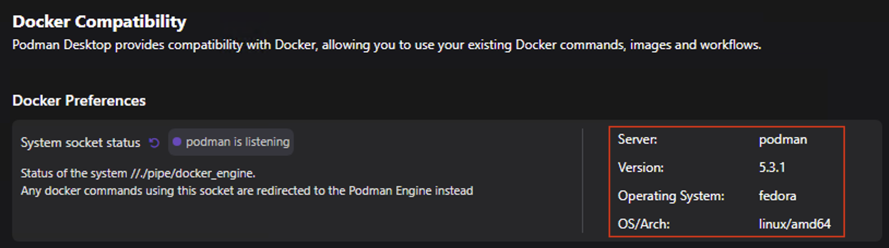
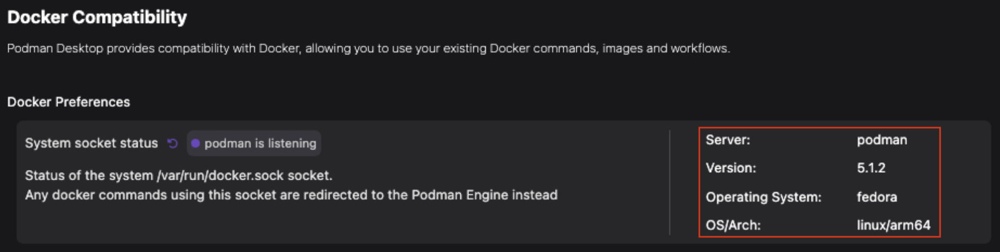
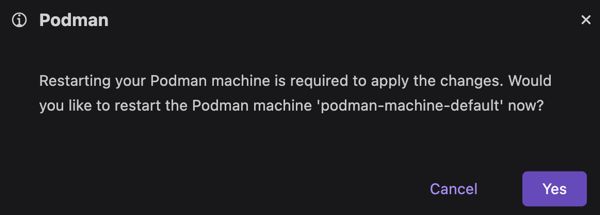
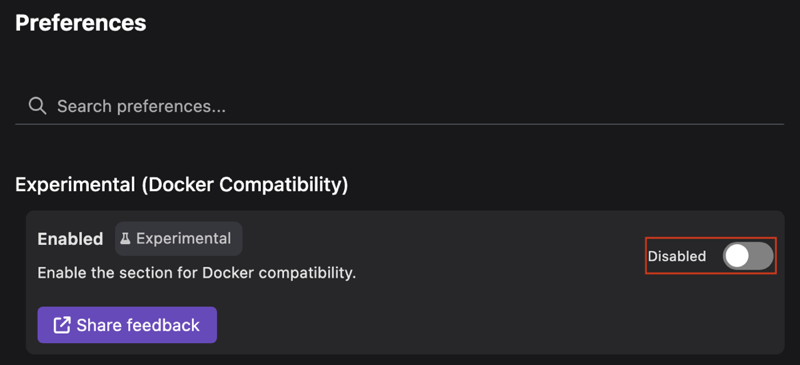

import Tabs from '@theme/Tabs';
import TabItem from '@theme/TabItem';

# Customizing Docker compatibility - Experimental feature

With Podman Desktop, you can customize the Docker compatibility feature. If you want to run your Docker applications on a Podman engine, you can enable the feature.

<Tabs groupId="operating-systems">
<TabItem value="win" label="Windows" className="markdown">

The binding between the Podman machine and the system socket is not known. So, Podman Desktop displays only the server information on the Docker Compatibility page.



</TabItem>
<TabItem value="macOS" label="macOS" className="markdown">

Podman Desktop uses the `podman-mac-helper` utility to automatically link the Docker socket to the Podman machine. This utility provides a compatibility layer that allows you to:

- Run Docker commands on a Podman engine.
- Make your tools, such as [Maven](https://maven.apache.org/) or [Testcontainers](https://www.testcontainers.com/) communicate with Podman without reconfiguration.

Podman Desktop provides information about the Podman machine that emulates the Docker socket on the Docker Compatibility page. Click the **Podman details** icon to view the details of the Podman machine.


</TabItem>
<TabItem value="linux" label="Linux" className="markdown">

The binding between the Podman machine and the system socket is not known. So, Podman Desktop displays only the server information on the Docker Compatibility page.



</TabItem>
</Tabs>

## Enable Docker compatibility

#### Prerequisites

- [A running Podman machine](/docs/podman/creating-a-podman-machine).

<Tabs groupId="operating-systems">
<TabItem value="win" label="Windows" className="markdown">

#### Procedure

- Perform one of the following steps:

  - Go to **Settings > Experimental**, and click the toggle button.
  - Go to **Settings > Preferences > Experimental (Docker Compatibility)**, and click the toggle button.

  A Docker Compatibility section is added to the list of **Settings**.

#### Verification

Perform any of the following steps:

- Run the following command to check the output returns the Podman version rather than the Docker version:

  ```shell-session
  $ docker info --format=json | jq -r .ServerVersion
  ```

- Run the `docker context list` command to check that the Docker CLI context is set to the default value `npipe:////./pipe/docker_engine`.

</TabItem>
<TabItem value="macOS" label="macOS" className="markdown">

#### Procedure

1. Click **Docker Compatibility** in the status bar. A notification opens.
1. Click **Enable**.
   
1. Enter your machine password when prompted. A successful operation notification opens.
1. Click **OK**. A notification prompts you to restart your Podman machine.
1. Click **Yes**.
   
1. Perform one of the following steps:

   - Go to **Settings > Experimental**, and click the toggle button.
     
   - Go to **Settings > Preferences > Experimental (Docker Compatibility)**, and click the toggle button.
     
     A Docker Compatibility section is added to the list of **Settings**.

#### Verification

Perform any of the following steps:

- Check whether the Docker socket is a symbolic link for the Podman socket:

  ```shell-session
  $ ls -la /var/run/docker.sock
  ```

  The output points to a `podman.sock` file, as shown below:

  ```shell-session
  /var/run/docker.sock -> /Users/username/.local/share/containers/podman/machine/podman.sock
  ```

- Run the following command to check the output returns the Podman version rather than the Docker version:

  ```shell-session
  $ curl -s --unix-socket /var/run/docker.sock "http://v1.41/info"  | jq -r .ServerVersion
  ```

- Run the `docker context list` command to check that the Docker CLI context is set to `unix:///var/run/docker.sock`.

</TabItem>
<TabItem value="linux" label="Linux" className="markdown">

#### Procedure

- Perform one of the following steps:

  - Go to **Settings > Experimental**, and click the toggle button.
  - Go to **Settings > Preferences > Experimental (Docker Compatibility)**, and click the toggle button.

  A Docker Compatibility section is added to the list of **Settings**.

#### Verification

Perform any of the following steps:

- Run the following command to check the output returns the Podman version rather than the Docker version:

  ```shell-session
  $ docker info --format=json | jq -r .ServerVersion
  ```

- Run the `docker context list` command to check that the Docker CLI context is set to the default value `unix:///var/run/docker.sock`.

</TabItem>
</Tabs>

## Disable Docker compatibility

#### Prerequisites

- [A running Podman machine](/docs/podman/creating-a-podman-machine).

<Tabs groupId="operating-systems">
<TabItem value="win" label="Windows" className="markdown">

#### Procedure

- Perform one of the following steps:

  - Go to **Settings > Experimental**, and click the toggle button.
  - Go to **Settings > Preferences > Experimental (Docker Compatibility)**, and click the toggle button.

  The Docker Compatibility section is removed from the list of **Settings**.

#### Verification

- Run the following command to check the output returns the Docker version rather than the Podman version:

  ```shell-session
  $ docker info --format=json | jq -r .ServerVersion
  ```

</TabItem>
<TabItem value="macOS" label="macOS" className="markdown">

#### Procedure

1. Click **Docker Compatibility** in the status bar. A notification opens.
1. Click **Disable**.
   
1. Enter your machine password when prompted. A successful operation notification opens.
1. Click **OK**. A notification prompts you to restart your Podman machine.
1. Click **Yes**.
1. Perform one of the following steps:

   - Go to **Settings > Experimental**, and click the toggle button.
   - Go to **Settings > Preferences > Experimental (Docker Compatibility)**, and click the toggle button.

   The Docker Compatibility section is removed from the list of **Settings**.

#### Verification

Perform any of the following steps:

- Check that the Docker socket is not a symbolic link for the Podman socket:

  ```shell-session
  $ ls -la /var/run/docker.sock
  ```

  The output returns the following:

  ```shell-session
  ls: /var/run/docker.sock: No such file or directory
  ```

- Run the following command to check the output returns the Docker version rather than the Podman version:

  ```shell-session
  $ curl -s --unix-socket /var/run/docker.sock "http://v1.41/info"  | jq -r .ServerVersion
  ```

</TabItem>
<TabItem value="linux" label="Linux" className="markdown">

#### Procedure

- Perform one of the following steps:

  - Go to **Settings > Experimental**, and click the toggle button.
  - Go to **Settings > Preferences > Experimental (Docker Compatibility)**, and click the toggle button.

  The Docker Compatibility section is removed from the list of **Settings**.

#### Verification

- Run the following command to check the output returns the Docker version rather than the Podman version:

  ```shell-session
  $ docker info --format=json | jq -r .ServerVersion
  ```

</TabItem>
</Tabs>

#### Additional resources

- [Managing Docker compatibility](/docs/migrating-from-docker/managing-docker-compatibility)
- [`podman-mac-helper` source](https://github.com/containers/podman/tree/main/cmd/podman-mac-helper)
