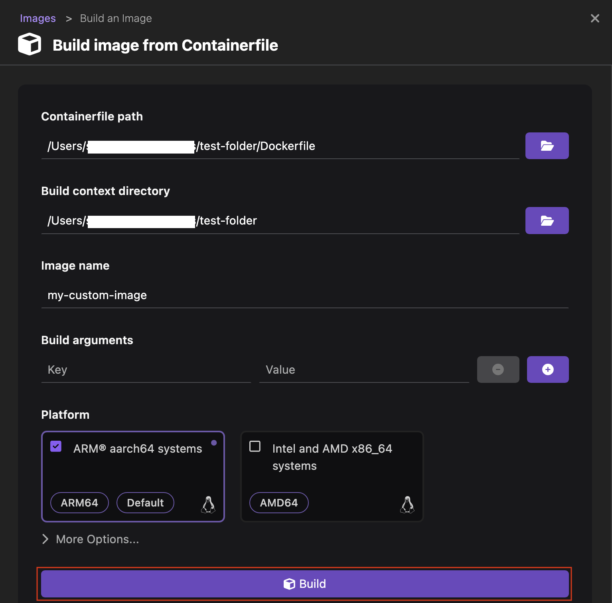
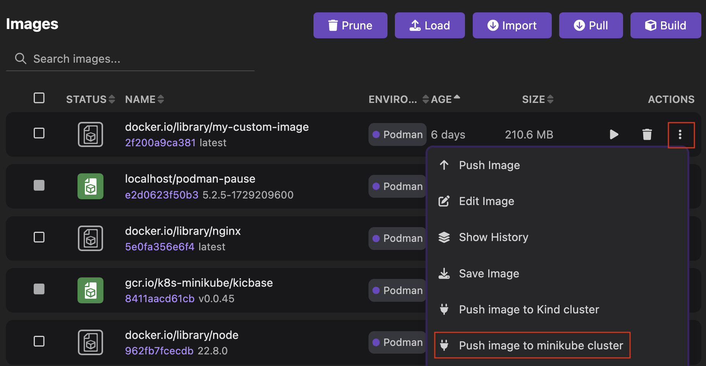
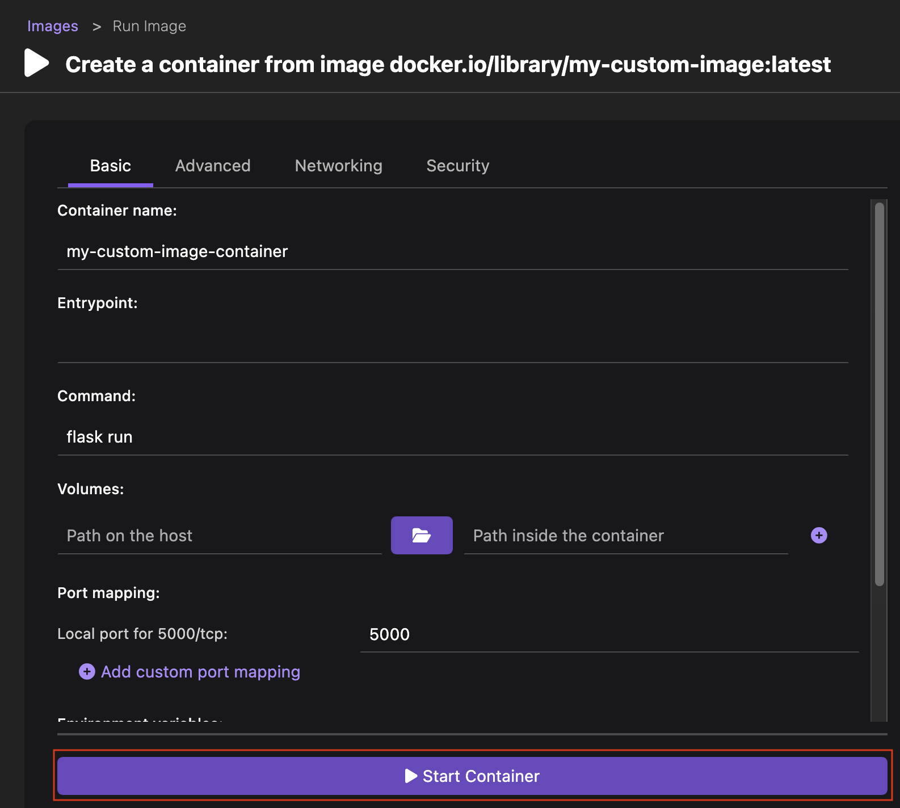
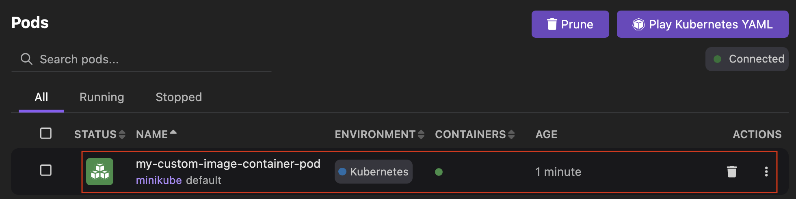

# Building an image and testing it in Minikube

With Podman Desktop, you can build an image with your container engine, and test it in your local Minikube-powered Kubernetes cluster.

#### Prerequisites

- [You onboarded a container engine](/docs/containers).
- [You onboarded a Minikube cluster](/docs/minikube).
- [You have set your Kubernetes context to your Minikube cluster](/docs/minikube/working-with-your-local-minikube-cluster).
- A container definition file: `Containerfile` or `Dockerfile`.

#### Procedure

1. Build your image:

   1. Go to **Images** from the left navigation pane.
   1. Click **Build**.
   1. Provide the relevant details, such as **Containerfile path**, **Image name**, and **Build arguments** to build the image. For example, use the image name `my-custom-image`.
   1. Click **Build**. Wait for the image build to finish.
      
   1. Click **Done** to view the new image on the same page.

1. Push your image to your Minikube cluster:

   1. Click the **overflow menu** icon corresponding to `my-custom-image` and select **Push image to minikube cluster**. A successful operation notification opens.
      
   1. Click **OK**.

1. Test your image by creating a container:

   1. Click the **Run Image** icon corresponding to the image `my-custom-image`.
      
   1. **Container name**: enter `my-custom-image-container`.
   1. Review the parameters that Podman Desktop has detected from your image definition or edit them, if required.
   1. Click **Start Container**.
      
   1. Select the **Summary** tab to view the details of the new container.
   1. Click the **Close** icon.

1. Test your image and container on your Minikube cluster:

   1. Click the overflow menu icon corresponding to the container and select **Deploy to Kubernetes**.
      
   1. Provide the following details:
      - **Pod Name**: Keep the proposed value `my-custom-image-container-pod`.
      - **Expose service locally using Kubernetes Ingress**: Select the checkbox to expose the service locally using the ingress controller.
      - Optional: If your container exposes more than one port, select the port to expose from the dropdown list.
   1. Click **Deploy**. Wait for the pod to reach the state: **Phase: Running**.
      
   1. Click **Done**.

#### Verification

1. Go to **Pods** from the left navigation pane.
1. View the running `my-custom-image-container-pod` pod.
   
1. Click the pod name to view its details and logs.
1. Optional: If your container exposes a port, go to `http://localhost:<port-number-exposed>`: your application is running.
