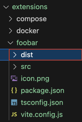
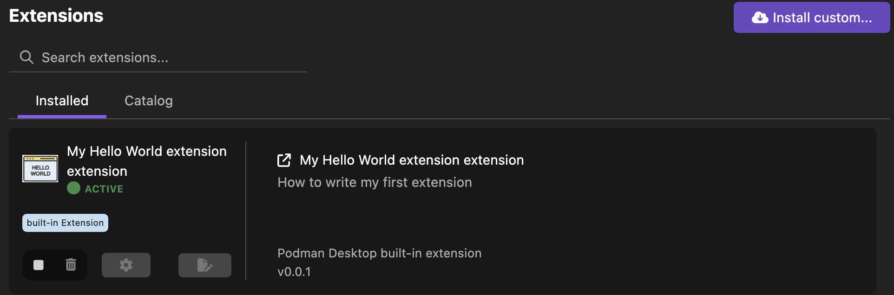
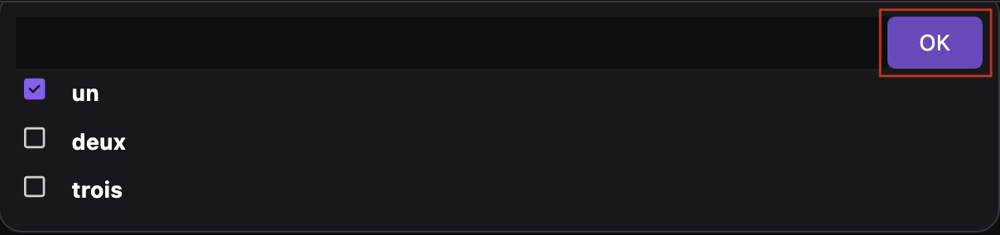
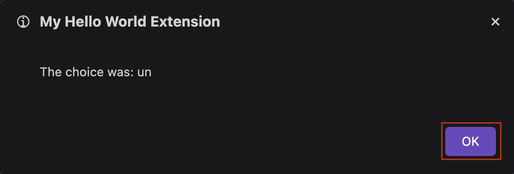

# Creating a Podman Desktop extension

This tutorial covers the following end-to-end tasks required to create and run a Podman Desktop extension:

- [Initializing an extension](/tutorial/creating-an-extension#initializing-an-extension)
- [Writing the extension entry point](/tutorial/creating-an-extension#writing-the-extension-entry-point)
- [Build dependencies](/tutorial/creating-an-extension#build-dependencies)
- [Running the extension](/tutorial/creating-an-extension#running-the-extension)
- [Verifying the extension's features](/tutorial/creating-an-extension#verifying-the-extensions-features)

You can write an extension in `TypeScript` or `JavaScript`. You can simplify extension creation by specifying two entry points: `activate()` and `deactivate()` from within the extension.

All Podman Desktop functionalities are communicated entirely through the [API](https://podman-desktop.io/api). The extension you create interacts with the Podman Desktop API through the `@podman-desktop/api` package. The type definition of the `@podman-desktop/api` API is hosted as part of the [`npm` package](https://www.npmjs.com/package/@podman-desktop/api).

## Before you begin

Make sure you have:

- [Installed Podman Desktop](/docs/installation).
- [A running Podman machine](/docs/podman/creating-a-podman-machine).
- A developer role.
- Installed `JavaScript` or `TypeScript`.
- A clone of the [Podman Desktop](https://github.com/podman-desktop/podman-desktop) repository on your local machine.

## Initializing an extension

Create a `package.json` file to initialize your extension.

1. Create a subdirectory, such as `foobar` in the `extensions` directory of the Podman Desktop repository.
1. Initialize a `package.json` file and add it the subdirectory.

   ```json
   {}
   ```

1. Add `TypeScript` and the Podman Desktop API to the development dependencies:

   ```json lines
    "devDependencies": {
      "@podman-desktop/api": "latest",
      "typescript": "latest",
      "vite": "latest"
    },
   ```

1. Add the required metadata:

   ```json lines
     "name": "my-extension",
     "displayName": "My Hello World extension",
     "description": "How to write my first extension",
     "version": "0.0.1",
     "icon": "icon.png",
     "publisher": "benoitf",
   ```

1. Add the Podman Desktop version to run the extension:

   ```json lines
     "engines": {
       "podman-desktop": "latest"
     },
   ```

1. Add the main entry point:

   ```json lines
    "main": "./dist/extension.js"
   ```

1. Add a `Hello World` command contribution:

   ```json lines
     "contributes": {
       "commands": [
        {
          "command": "my.first.command",
          "title": "My First Extension: Hello World"
        }
      ]
     }
   ```

1. Validate the complete `package.json` file manually:

   **_Example: The complete `package.json` file_**

   ```json
   {
     "devDependencies": {
       "@podman-desktop/api": "latest",
       "typescript": "latest",
       "vite": "latest"
     },
     "name": "my-extension",
     "displayName": "My Hello World extension",
     "description": "How to write my first extension",
     "version": "0.0.1",
     "icon": "icon.png",
     "publisher": "benoitf",
     "engines": {
       "podman-desktop": "latest"
     },
     "scripts": {
       "build": "vite build",
       "test": "vitest run --coverage",
       "test:watch": "vitest watch --coverage",
       "watch": "vite build --watch"
     },
     "main": "./dist/extension.js",
     "contributes": {
       "commands": [
         {
           "command": "my.first.command",
           "title": "My First Extension: Hello World"
         }
       ]
     }
   }
   ```

1. Add an `icon.png` file to the subdirectory.

## Writing the extension entry point

1. Create a `src/extension.ts` file in the subdirectory.

1. Import the Podman Desktop API into the file:

   ```typescript
   import * as podmanDesktopAPI from '@podman-desktop/api';
   ```

1. Use one of the following ways to expose the `activate` function:

   - Synchronous (sequential execution of tasks)

     ```typescript
     export function activate(): void;
     ```

   - Asynchronous (parallel execution of tasks)

     ```typescript
     export async function activate(): Promise<void>;
     ```

1. Optional: Add an extension context to the `activate` function by enabling the extension to register disposable resources:

   ```typescript
   export async function activate(extensionContext: podmanDesktopAPI.ExtensionContext): Promise<void> {}
   ```

1. Add the features of the extension to the file. This sample extension:

   - Registers the command referenced in the `package.json` file.
   - Displays an option for the user to select values from the dropdown list.
   - Displays a pop-up message with the values selected by the user.
   - Creates an item in the status bar to run the command.

   ```typescript
   import * as podmanDesktopAPI from '@podman-desktop/api';
   export async function activate(extensionContext: podmanDesktopAPI.ExtensionContext): Promise<void> {
     // register the command referenced in package.json file
     const myFirstCommand = podmanDesktopAPI.commands.registerCommand('my.first.command', async () => {
       // display a choice to the user for selecting some values
       const result = await podmanDesktopAPI.window.showQuickPick(['un', 'deux', 'trois'], {
         canPickMany: true, // user can select more than one choice
       });

       // display an information message with the user choice
       await podmanDesktopAPI.window.showInformationMessage(`The choice was: ${result}`);
     });

     // create an item in the status bar to run our command
     // it will stick on the left of the status bar
     const item = podmanDesktopAPI.window.createStatusBarItem(podmanDesktopAPI.StatusBarAlignLeft, 100);
     item.text = 'My first command';
     item.command = 'my.first.command';
     item.show();

     // register disposable resources to it's removed when you deactivte the extension
     extensionContext.subscriptions.push(myFirstCommand);
     extensionContext.subscriptions.push(item);
   }
   ```

1. Optional: Use one of the following ways to expose the `deactivate` function:

   - Synchronous

     ```typescript
     export function deactivate(): void;
     ```

   - Asynchronous

     ```typescript
     export async function deactivate(): Promise<void>;
     ```

     :::note

     The above example is not a full representation of every functionality an extension can be used for. You can expand the internal Podman Desktop functionalities, such as creating a new provider and adding new commands. See our [API documentation](https://podman-desktop.io/api) for more information.

     :::

## Build dependencies

You can build this extension by configuring `TypeScript` and `Vite`.

1. Create a file named `tsconfig.json` with the following content in the subdirectory:

```json
{
  "compilerOptions": {
    "module": "esnext",
    "lib": ["ES2017"],
    "sourceMap": true,
    "rootDir": "src",
    "outDir": "dist",
    "target": "esnext",
    "moduleResolution": "Node",
    "allowSyntheticDefaultImports": true,
    "resolveJsonModule": true,
    "skipLibCheck": true,
    "types": ["node"]
  },
  "include": ["src", "types/*.d.ts"]
}
```

2. Create a file named `vite.config.js` with the following content in the subdirectory:

```javascript
/**********************************************************************
 * Copyright (C) 2023 Red Hat, Inc.
 *
 * Licensed under the Apache License, Version 2.0 (the "License");
 * you may not use this file except in compliance with the License.
 * You may obtain a copy of the License at
 *
 * http://www.apache.org/licenses/LICENSE-2.0
 *
 * Unless required by applicable law or agreed to in writing, software
 * distributed under the License is distributed on an "AS IS" BASIS,
 * WITHOUT WARRANTIES OR CONDITIONS OF ANY KIND, either express or implied.
 * See the License for the specific language governing permissions and
 * limitations under the License.
 *
 * SPDX-License-Identifier: Apache-2.0
 ***********************************************************************/

import { join } from 'path';
import { builtinModules } from 'module';

const PACKAGE_ROOT = __dirname;

/**
 * @type {import('vite').UserConfig}
 * @see https://vitejs.dev/config/
 */
const config = {
  mode: process.env.MODE,
  root: PACKAGE_ROOT,
  envDir: process.cwd(),
  resolve: {
    alias: {
      '/@/': join(PACKAGE_ROOT, 'src') + '/',
    },
  },
  build: {
    sourcemap: 'inline',
    target: 'esnext',
    outDir: 'dist',
    assetsDir: '.',
    minify: process.env.MODE === 'production' ? 'esbuild' : false,
    lib: {
      entry: 'src/extension.ts',
      formats: ['cjs'],
    },
    rollupOptions: {
      external: ['@podman-desktop/api', ...builtinModules.flatMap(p => [p, `node:${p}`])],
      output: {
        entryFileNames: '[name].js',
      },
    },
    emptyOutDir: true,
    reportCompressedSize: false,
  },
};

export default config;
```

## Running the extension

1. Stop the Podman Desktop application if it runs in the background.
1. Run the following command from your clone of the Podman Desktop repository:

   ```shell
   pnpm watch --extension-folder <path-to-your-extension>
   ```

   The extension compiles and generates the output in the `dist` folder of the subdirectory.
   

## Verifying the extension's features

1. Click **Extensions** in the left navigation pane.
1. Search the created `My Hello World` extension in the list. The extension is `ACTIVE`.
   
1. Verify the features of the extension:
1. Click the `My first command` item in the status bar. A dropdown list opens.
1. Select a value from the dropdown list.
1. Click **OK**. A pop-up notifying the selected value opens.
   
1. Click **OK**.
   

   :::note

   If you have created a webview extension, you can access the console of the extension:

   1. Right-click the extension icon in the left navigation pane.
   1. Select **Open Devtools of the webview**.

   :::

## Additional resources

- [Podman Desktop API code](https://github.com/podman-desktop/podman-desktop/blob/main/packages/extension-api/src/extension-api.d.ts)
- [Podman Desktop API documentation](https://podman-desktop.io/api)
- [Overview - Creating an extension](/docs/extensions/developing#overview-of-creating-a-new-extension)
- [Expanding your extension](/docs/extensions/developing#expanding-your-extension)
- [Publishing a Podman Desktop extension](/docs/extensions/publish)
